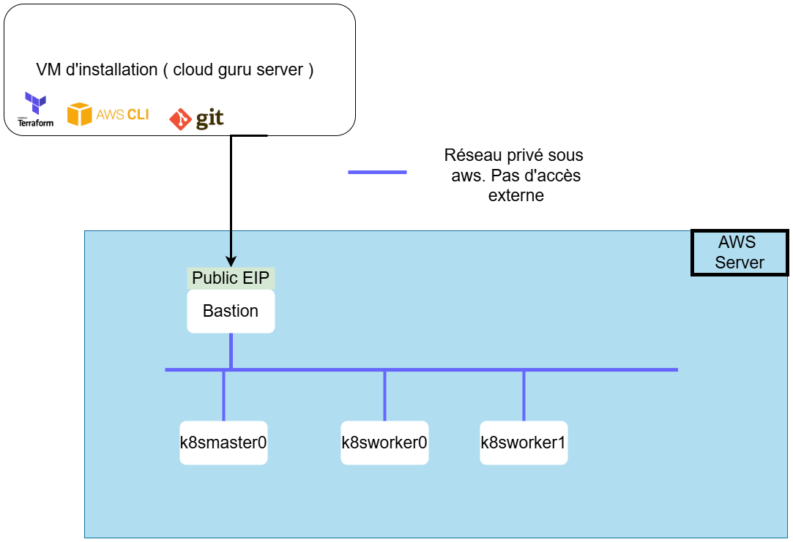
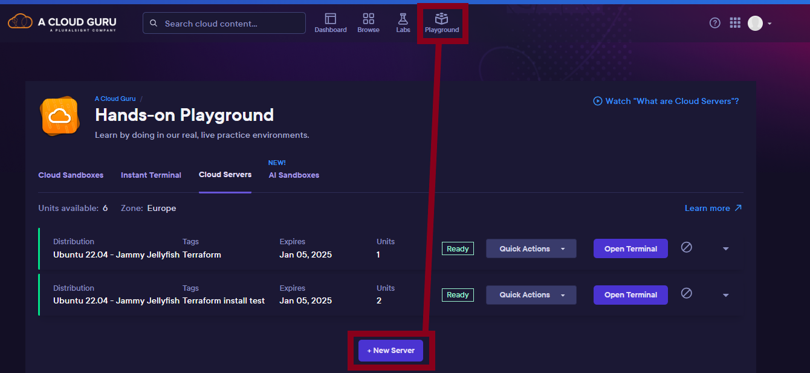
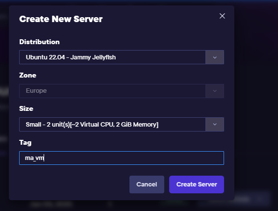
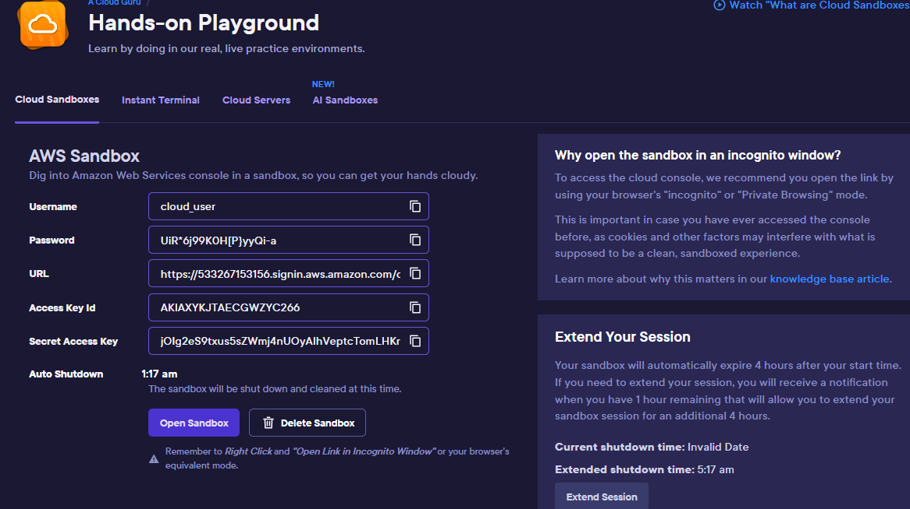

# CKA_FORMATION
 
Ce projet a pour objectif  d'installer un cluster kubernetes en mode "On premise" sous aws  à l'aide de cloud guru
  </img>

<ol>
  <li><h3>Création de la Vm de provisionnement:  </h3></li>
  Se rendre dans les playground de cloud guru et créer une VM. avec les caractéristiques suivantes:  
    Taille Small  
    Distribution:  Ubuntu  
    Tag:  le nom de la Vm souhaité  
  </img>
  </img>
 

  <li><h3> Récupération des sources </h3> </li>
    Se connecter sur la VM  précédemment créée et suivez les instructions.  Cette Vm a une période de validité de 2 semaines. A chaque fois que vous la démarrée la période est reconduite de 2 semaines.  
    Récupérer les sources comme suit: 
    <pre> 
     wget wget https://github.com/lbouquinD/CKA_FORMATION/archive/refs/tags/0.0.1.tar.gz 
     tar -xvf 0.0.1.tar.gz  
     cd CKA_FORMATION-0.0.1
    </pre>
 

<li><h3> Instanciation de l'instance AWS  sur lequel va être provisionner l'ensembles des VM </h3></li>

Récupérer l'access  key  id et  la Secret Access Key.  
L'environnement est  disponible pendant 4h renouvelable une fois  

  <li><h3> Installation de l'environnement </h3></li>
  Lancer les scripts  <pre>./1-installPackages.sh #  installation des dépendances ( awscli et  terraform ) </pre>  et  <pre>./2-initK8sCluster.sh # Installatiion des VMs/du cluster </pre> sur <b><i>ma_vm</i></b> 
  Lors de l'execution du  2 ème script il vous sera demandé les clés AWS de l'étape précédente   
  1. Choisissez entre les oiptions  proposées:   
  <pre>       1. Option on_premise:  installe uniquement les VMs sur aws et  configure le tunel ssh pour accéder au différentes VMs  </pre>
  <pre>       2. Verion EKS:  Installe directement un cluster kubernetes sur aws </pre>
  Laisser les champs  suivants à None. La configuration se fait par terraform
 Default region name 
 Default output format  
 

</ol>
